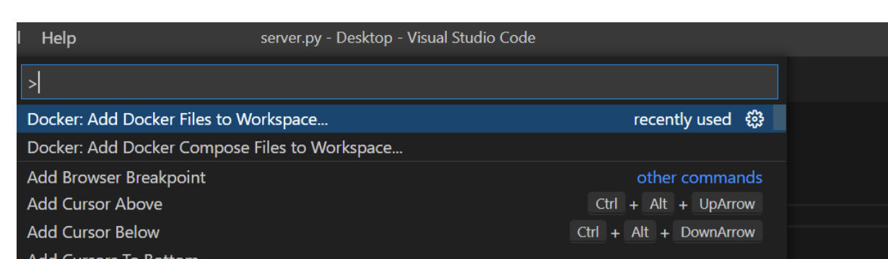
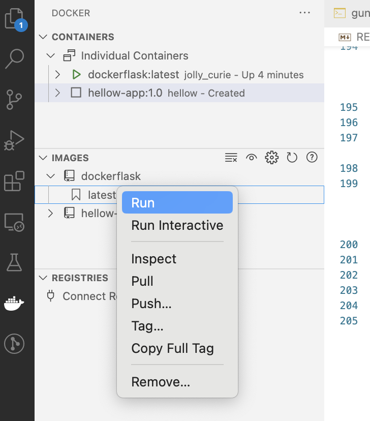

# Dockerize Flask and Gunicorn with VSCode <!-- omit from toc -->

These examples follows the followig tutorial

Analytics Vidya
https://www.analyticsvidhya.com/blog/2022/08/building-a-simple-flask-app-using-docker-vs-code/

Repo
https://github.com/microsoft/python-sample-vscode-flask-tutorial

# Table of Contents  <!-- omit from toc -->
- [Additional References](#additional-references)
- [Server](#server)
- [Index.html](#indexhtml)
- [Requirements](#requirements)
- [Gunicorn](#gunicorn)
- [Create DockerFile in VSCode](#create-dockerfile-in-vscode)
- [Build the Image in VS Code](#build-the-image-in-vs-code)
- [Run the Containerized Image](#run-the-containerized-image)
- [Check on Docker Containers and Images](#check-on-docker-containers-and-images)
- [Go to Browser](#go-to-browser)
- [Build and Run Manually](#build-and-run-manually)
- [Understand the docker options](#understand-the-docker-options)
- [Appendix - Docker Commands](#appendix---docker-commands)


# Additional References

Docker VScode ... docket with fastapi
https://code.visualstudio.com/docs/containers/quickstart-python

Getting Started with Docker
https://towardsdatascience.com/the-nice-way-to-use-docker-with-vscode-f475c49aab1b

dockerize your datascience app
https://pub.towardsai.net/how-to-dockerize-your-data-science-project-a-quick-guide-b6fa2d6a8ba1


fastai image classification app
https://towardsdatascience.com/a-guide-to-streamlit-frontend-for-data-science-made-simpler-c6dda54e3183 

# Server

This python script is for creating a flask app that, when run, renders the template contained in ‘index.html’.

server.py
```
from flask import render_template,request,Flask,redirect

# flask object name is "app"
app = Flask(__name__,template_folder='templates')

@app.route('/')
def index():

    return render_template('index.html')

if __name__=="__main__":
    
    app.run()

```

# Index.html

In the templates folder, the file ‘index.html’ contains a simple template comprising a single line of text as a heading.

./templates/index.html
```
<h1> Flask App Hello World</h1>
```


# Requirements


```
flask
gunicorn
```

# Gunicorn

This file contains all the python packages one would need to install to run this app.

gunicorn.sh

Although Flask has a built-in web server, it is unsuitable for production and needs to be installed behind a real web server that can connect with Flask via the WSGI protocol. A common choice for this web server is Gunicorn.

This shell script file helps launch the Gunicorn server. The script contains the following:

```
gunicorn server:app -b 0.0.0.0:5002 -- timeout 900
```

The above line is a gunicorn command for launching the server where ‘server’ refers to the module we have built (server.py) while ‘app’ refers to the variable name given to our Flask object. 

The ‘-b’ in the command helps specify a socket to bind the server. Since some applications need more time to respond than others, we can explicitly set ‘timeout’ to a higher number (in seconds) to ensure that a longer time is given for the application to load.

# Create DockerFile in VSCode

first add the Docker packate to VSCode

then, inside VSCode
```
 CMD+Shift+P
   Docker: Add Docker Files to Workspace
```




select ‘Python Flask’ as the language.

VSCode will create the Dockerfile


```
# For more information, please refer to https://aka.ms/vscode-docker-python
FROM python:3.10-slim

EXPOSE 5002

# Keeps Python from generating .pyc files in the container
ENV PYTHONDONTWRITEBYTECODE=1

# Turns off buffering for easier container logging
ENV PYTHONUNBUFFERED=1

# Install pip requirements
COPY requirements.txt .
RUN python -m pip install -r requirements.txt

WORKDIR /app
COPY . /app

# Creates a non-root user with an explicit UID and adds permission to access the /app folder
# For more info, please refer to https://aka.ms/vscode-docker-python-configure-containers
RUN adduser -u 5678 --disabled-password --gecos "" appuser && chown -R appuser /app
USER appuser

# During debugging, this entry point will be overridden. For more information, please refer to https://aka.ms/vscode-docker-python-debug
CMD ["gunicorn", "--bind", "0.0.0.0:5002", "server:app"]


```

The WORKDIR instruction sets the working directory for any RUN, CMD, ENTRYPOINT, COPY and ADD instructions that follow it in the Dockerfile.


# Build the Image in VS Code

A Docker image gets built by running a Docker command (which uses the Dockerfile we created).


Right-click the docker file on VS code’s Explorer tab and choose the ‘Build Image’ option. This helps create a docker image containder from the docker file we created.



# Run the Containerized Image 

The container is a running instance of a Docker image.

We can run the Docker image we created by going to the VS code on the Docker tab. We can choose the image (under Images) we want to run and start running it.

# Check on Docker Containers and Images

```
$ docker ps -a

CONTAINER ID   IMAGE                COMMAND                  CREATED         STATUS         PORTS                    NAMES
b9fff3a9f82e   dockerflask:latest   "gunicorn --bind 0.0…"   5 minutes ago   Up 5 minutes   0.0.0.0:5002->5002/tcp   jolly_curie
0bf34167eeec   hellow-app:1.0       "gunicorn --bind 0.0…"   2 hours ago     Created        8000/tcp                 hellow
```

notice the randomly chosen name "jolly_curie"

# Go to Browser 

http://localhost:5000


# Build and Run Manually

First stop the running container that was lauched above

docker stop container-id
```
$docker stop b9fff3a9f82e
```

Build a new image with the -t tag

```
docker build . -t flask-hello-app:1.0 
```

list the docker images
```
$ docker images

REPOSITORY        TAG       IMAGE ID       CREATED          SIZE
flask-hello-app   1.0       642c550ba84f   12 seconds ago   133MB
dockerflask       latest    ddf4b0e34520   35 minutes ago   133MB
hellow-app        1.0       41d5242163d3   2 hours ago      228MB
```

Notice now we have a new image with the tag flask-hello-app and new image-id e82ac8321f05 


run the container

```
docker run  -p 5002:5002/tcp  --name flask-app-demo flask-hello-app:1.0
```

the tcp is optional ... explicitly points to tcp port 80

```
docker run  -p 5002:5002 --name flask-app-demo flask-hello-app:1.0
```

# Understand the docker options
https://docs.docker.com/engine/reference/commandline/run/

(https://prairielearn.readthedocs.io/en/latest/docker/)

-d run in the backround and print container id

-it means "run this container interactively."

--rm means "delete this container when I'm done with it." Unless you have a reason to keep a container, you should always use this flag. 

-p 3000:3000 means "forward port 3000 on the host to port 3000 in the container."


# Appendix - Docker Commands

Stackoverflow 
https://stackoverflow.com/questions/33907835/docker-error-cannot-delete-docker-container-conflict-unable-to-remove-reposito
```
Save this answer.
There is a difference between docker images and docker containers. Check this SO Question.

In short, a container is a runnable instance of an image. which is why you cannot delete an image if there is a running container from that image. You just need to delete the container first.

docker ps -a                # Lists containers (and tells you which images they are spun from)

docker images               # Lists images 

dockder container ls        # list containners

docker rm <container_id>    # Removes a stopped container

docker rm -f <container_id> # Forces the removal of a running container (uses SIGKILL)

docker rmi <image_id>       # Removes an image 
                            # Will fail if there is a running instance of that image i.e. container

docker rmi -f <image_id>    # Forces removal of image even if it is referenced in multiple repositories, 
                            # i.e. same image id given multiple names/tags 
                            # Will still fail if there is a docker container referencing image

docker stop [OPTIONS] CONTAINER [CONTAINER...] Y

docker image prune -a --all # remove all images

docker system prune -a      # remove everything

docker container ls -a
docker image ls
docker container rm <container_id>
docker image rm <image_id>

docker system prune -a  # remove everything
```
